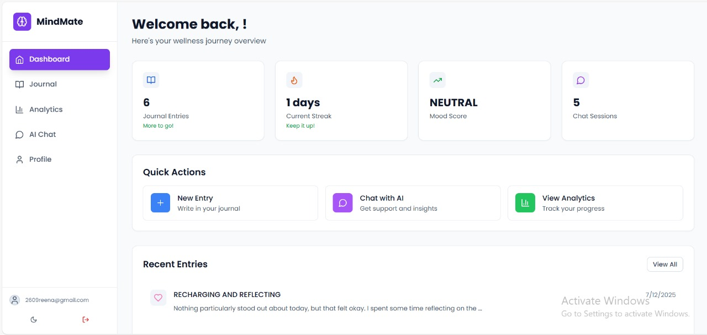

# 🧠 MindMate — Your Personal Mental Health Journal & AI Companion

> Your intelligent mental health companion for journaling, mood tracking, and personalized support.


---

## 📌 Overview

MindMate is a full-stack mental wellness application designed to help users track their emotional health through journaling, gain insights from their mood patterns, and interact with a context-aware AI companion.


**📖 Repository:** [https://github.com/reenagupta-tech/MindMate](https://github.com/reenagupta-tech/MindMate)

---

## ✨ Features

### 📝 Journal Management (CRUD)
- Create, view, update, and delete personal journal entries
- Filter entries by mood, date, or keywords
- Private and secure storage of mental health data
- Mood tracking with visual indicators

### 🤖 Context-Aware AI Chatbot
- Integrated Google Gemini API
- Provides intelligent, personalized conversations based on recent journal history
- Offers mental health advice and conversation prompts tailored to user mood
- Real-time chat interface with message history

### 📊 Analytics Dashboard
- Visualize mood trends over time
- Track journaling streaks and frequency
- Gain insight into emotional patterns with real-time charts
- Weekly mood distribution analysis

### 🔐 User Authentication
- Secure JWT-based authentication
- User registration and login
- Protected routes and session management
- Token refresh mechanism

---

## 🛠️ Tech Stack

| Frontend     | Backend        | Database      | AI Integration     |
|--------------|----------------|----------------|---------------------|
| React + Vite | Spring Boot    | MongoDB Atlas | Google Gemini API   |

---


## 🏗️ Project Structure

```
MindMate/
├── 📁 MindMate-frontend/          # React + TypeScript Frontend
│   ├── 📁 src/
│   │   ├── 📁 Api/                # API configuration and services
│   │   ├── 📁 components/         # Reusable UI components
│   │   │   ├── 📁 auth/           # Authentication components
│   │   │   ├── 📁 chat/           # Chat interface components
│   │   │   ├── 📁 journal/        # Journal management components
│   │   │   └── 📁 shared/         # Common UI components
│   │   ├── 📁 contexts/           # React Context providers
│   │   ├── 📁 pages/              # Main application pages
│   │   └── 📄 main.jsx            # Application entry point
│   ├── 📄 package.json            # Frontend dependencies
│   ├── 📄 vite.config.ts          # Vite configuration
│   └── 📄 tailwind.config.js      # Tailwind CSS configuration
│
├── 📁 MindMate-backend/           # Spring Boot Backend
│   ├── 📁 src/main/java/
│   │   └── 📁 com/example/MindMate/
│   │       ├── 📁 config/         # Security and configuration
│   │       │   └── 📁 security/   # JWT and Spring Security
│   │       ├── 📁 controllers/    # REST API endpoints
│   │       ├── 📁 DTO/            # Data Transfer Objects
│   │       ├── 📁 entities/       # Database entities
│   │       ├── 📁 Repositories/   # Data access layer
│   │       └── 📁 service/        # Business logic layer
│   ├── 📁 src/main/resources/
│   │   └── 📄 application.properties  # Backend configuration
│   ├── 📄 pom.xml                 # Maven dependencies
│   └── 📄 Dockerfile              # Container configuration
│
└── 📄 README.md                   # Project documentation
```


## 🛠️ Setup & Installation

> Make sure **Node.js**, **Maven**, and **MongoDB Atlas** are set up before proceeding.

### 🔹 Step 1: Clone the Repository
```bash
git clone https://github.com/your-username/MindMate.git
cd MindMate
```

---

### 🔹 Step 2: Setup Environment Variables

#### 🧾 Backend (`/server/src/main/resources/application.properties`)
```properties
spring.data.mongodb.uri=<YOUR_MONGO_URI>
gemini.api.key=<YOUR_GOOGLE_GEMINI_API_KEY>
```

✅ You can also create a file named:  
`server/src/main/resources/application.properties.example` to show examples.

---

### 🔹 Step 3: Run Backend (Spring Boot)
```bash
cd server
./mvnw spring-boot:run
```

---

### 🔹 Step 4: Run Frontend (React + Vite)
```bash
cd client
npm install
npm run dev
```

---

### 🔹 Step 5: Visit the App
Open your browser at:  
📍 `http://localhost:5173` (React frontend)  
📍 `http://localhost:8080` (Spring Boot API backend)

---


## 📱 Screenshots





---


<div align="center">
  <p>Made with ❤️ by <a href="https://github.com/reenagupta-tech">reenagupta-tech</a></p>
  <p>If you find this project helpful, please give it a ⭐️!</p>
</div>


